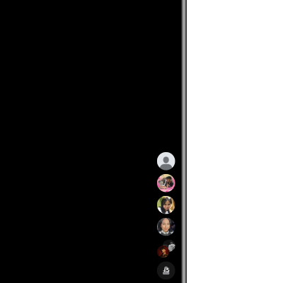

# 🐾 Brew ni Cat POS 
## *Bionic Glass Architecture & Production Milestone*

  

**Brew ni Cat POS** is a high-performance, offline-first Android Point-of-Sale system built for modern retail. Featuring a sophisticated "Bionic Glass" design language and a robust Room v11 database backbone, this application delivers a premium, adaptive experience for fast-paced, cat-themed retail environments.

---

## 🚀 What's New in v1.1.0
This release marks a major production milestone, transitioning the core into a reactive, adaptive, and fully un-hardcoded architecture:

* **Bionic Glass Architecture:** Implemented a system-wide adaptive glassmorphism design language, featuring smooth `iOSSpringSpec` physics, nested scrolling scaffold animations, and adaptive layouts for mobile and tablet parity.
* **Reactive Data Pipeline:** Migrated from one-shot fetches to a real-time reactive stream using Room v11 and Kotlin Flow, ensuring history logs and inventory deducts update instantly.
* **Dynamic Operations:** Introduced a zero-migration `PaymentConfigJson` wrapper, allowing for real-time management of GCash rosters and cashier profiles without database version bumps.
* **Responsive Engine:** Fully adaptive storefront catalog that intelligently switches between single-column mobile viewports and dual-pane tablet sidebars.
* **Timezone-Sanitized Sync:** Precision timestamp mapping ensuring 100% calendar accuracy across Z-reading reporting.

---

## 🏗️ Core Architecture
We prioritize clean, maintainable code using industry-standard patterns:

| Layer | Technology |
| :--- | :--- |
| **Language** | Kotlin (Coroutines, Flow) |
| **UI Toolkit** | Jetpack Compose + Material 3 |
| **Database** | Room (v11) with Reactive Streams |
| **Architecture** | MVVM + Repository Pattern |
| **Physics** | iOS-inspired Spring Dynamics |

---

## 📋 Key Features

* **Adaptive Inventory Engine:** Multi-variant mapping (Sizes + Flavors) for precision Bill of Materials (BOM) management.
* **Financial Integrity:** Robust Z-Reading generation with detailed tax/expense reporting and live cash flow tracking.
* **Adaptive UX:** Built-in mobile/tablet responsive viewports with seamless collapsible checkout panels.
* **Operational Security:** PIN-protected administration and dynamic resource management.
* **Bluetooth Connectivity:** ESC/POS service for hardware receipt printing.

---

## ⚙️ Setup Instructions

1.  **Clone the Repository:** `git clone https://github.com/RodneeGlenMartin/Brew-ni-Cat-POS.git`
2.  **Open in Android Studio:** Ensure you are using the latest stable Flamingo/Giraffe build or higher.
3.  **Sync Gradle:** Allow the project to fetch all dependencies.
4.  **Deploy:** Click **Run** (`Shift + F10`) to build.
    * *Note: Ensure you have an active Bluetooth ESC/POS printer paired if you intend to test printing workflows on physical hardware.*

---

## 🛡️ License
MIT License. Copyright (c) 2026 Brew-Ni-Cat Coffee Shop.
